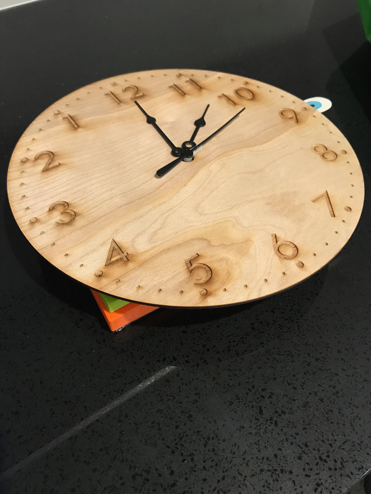
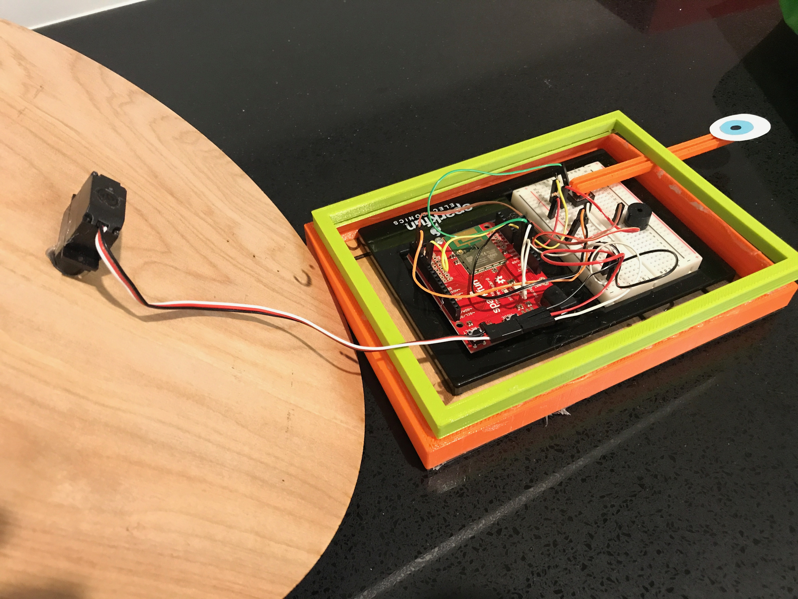
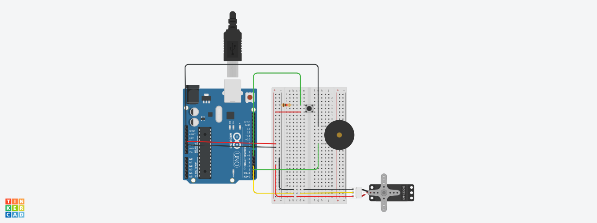

# Midterm IoT Project

Name:  Camila Vargas Restrepo

Date: October 12, 2017

## Project: Watch-ing

### Conceptual Description


My project was inspired by the research I did for this class on energy smart meters and, more broadly, by our discussions on IoT devices and what they seek to quantify. A fundamental characteristic of IoT devices is that they are able to sense and record information that has been up to now, to some extent, out of our awareness. The datification of our everyday lives involves the collection, interpretation and transformation of abstract behaviors into quantifiable and computerized data points that can be made visible through the use of a variety of software and tools. 

The processes through which we materialize behaviors or concepts always involve some arbitrary symbols and conventions. Moreover, they involve physical objects that are sometimes taken for granted. This parallel's Jennifer Gabrys' discussion of the materiality of chips. 

To express and engage with some of these ideas, I chose to focus on an abstract concept that we have been obsessed with for centuries and we have tried to quantify and visualize in a multiplicity of ways: time. I constructed a clock since it is one of the most common ways to visualize time. 

### Form

The project has multiple layers:

**Behavioral conditioning:** the clock’s numbers have been flipped in order to play with people’s perceptions and assumptions about the ways in which we represent abstract concepts. Through the widespread use of clocks (although it is debatable whether new generations will see analog clocks the same way) we have been conditioned to understand certain hand arrangements to mean specific things. A 90º angle with the long hand pointing upwards and the short hand pointing right is easily associated with 3:00. However, in my clock, this means 9:00. The idea is that the inversion will make the audience pause and reflect on the arbitrariness of the conventions used to measure and indicate time. 

**Measurement metaphor:** the increasing interest to measure, quantify, and visualize energy parallels the need to save it and make better use of it. I wanted to address this issue by creating an analogy with time. As time became an indispensable resource (“time is money”) we became increasingly interested in quantifying it and visualizing it in order to control it. (This episode of Radiolab served as inspiration: http://www.radiolab.org/story/91585-unlocking-the-secrets-of-time/). 

The paradox is that the more we pay attention to time, the faster it appears to pass (think about the speeding up of time in modernity). This is why, the “Watch-ing” clock moves counterclockwise (so time moves forward in the clock since it’s flipped) when people are looking at it (the action of looking is symbolized through the button that looks like an eye). When people are not looking at it, the clock moves clockwise (that is backwards in this clock). This is supposed to allude to the consequences of measuring, quantifying and materializing abstract concepts. 

**Finished Enclosure:**



**Electronics Exposed:**



### Technical Details
//   
Overview of the technical operation of my device, including:

**Wiring diagram** 


**List of Hardware Used**
* Half+ breadboard
* SparkFun Photon Redboard
* Momentary Pushbutton Switch - 12mm Square
* Servo - Generic motor
* Mini Piezo Speaker 

**Explanation of my code**

Put simply my code does the following: 
   a. if button pressed (proxy for looking) move counterclockwise.
   b. if button not pressed move clockwise. 
   c. communicate message to Rob
   d. listen for Rob's message and sound an alarm when appropriate

For a. and b., in each iteration of the loop there's a reading of the button input which leads to the servo moving either clockwise or counterclockwise. The position starts at 90 and it is updated by adding 6 degrees (360/60) or substracting 6 degrees every second (delay (1000)). 

```
  int position = 90;
  press1 = digitalRead(button1);
 
  if(press1 == LOW){ // when button not pressed, move clockwise
    position += 6;
    myservo.write(position);                 
    delay(1000);
    Serial.println(position);
    Serial.print("LOW");
    countsec == 0; // reset counsec to 0
  } 
    
  else { // when button  pressed, move counter-clockwise
  	position -= 6; 
    myservo.write(position);                 
    delay(1000);
    Serial.println(position);
    Serial.print("HIGH");
    countsec += 1; //start counting seconds since button was pressed
  }
```

For c. and d. We first subscribe inside void setup()

```
 Particle.subscribe("rob-camila", lowMoisture); // set up function to connect to Rob
```

On one hand, Rob communicated with my clock. The function lowMoisture triggers an alarm in my clock whenever the message hour is transmitted.

```
void lowMoisture(const char *event, const char *data){
    String message = data;
    if (message == "hour"){
        tone(ALARM_PIN, 523, 2000);}
}
```
On the other hand, if the person has spent a long time (proxy is 20s in this prototype) looking at the clock, this triggers a "Great Day!" message. This is then displayed in Rob's device. 

```
if (countsec == 20){ // if button has been pressed for 20 seconds, publish that it's been a great day. 
      Particle.publish("rob-camila", "Great Day!");
      countsec == 0;
  }
```
  


Link to my project's full code in this repository:  [photon.ino](photon.ino)

